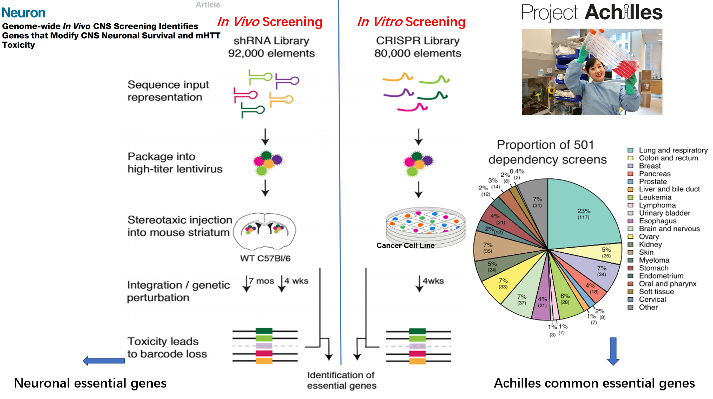
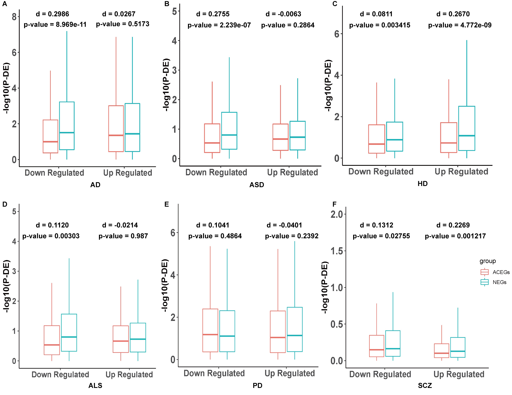
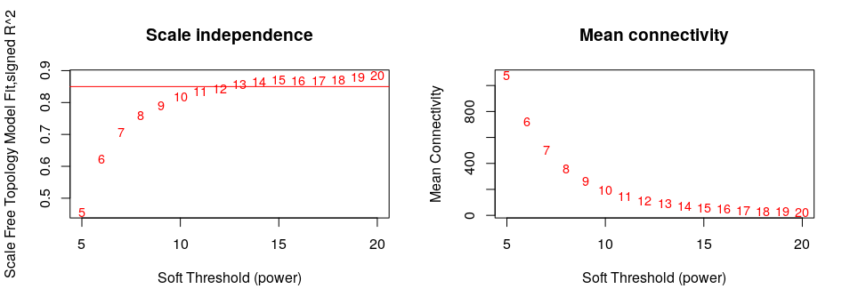
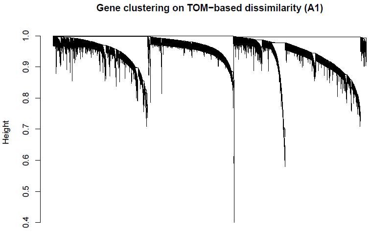
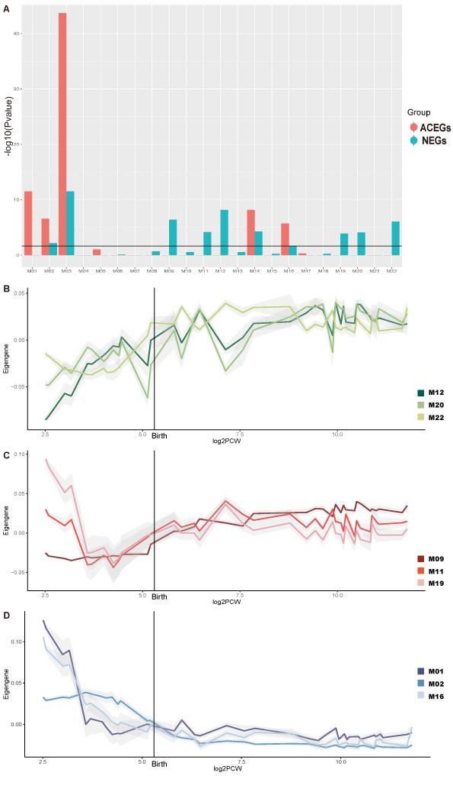
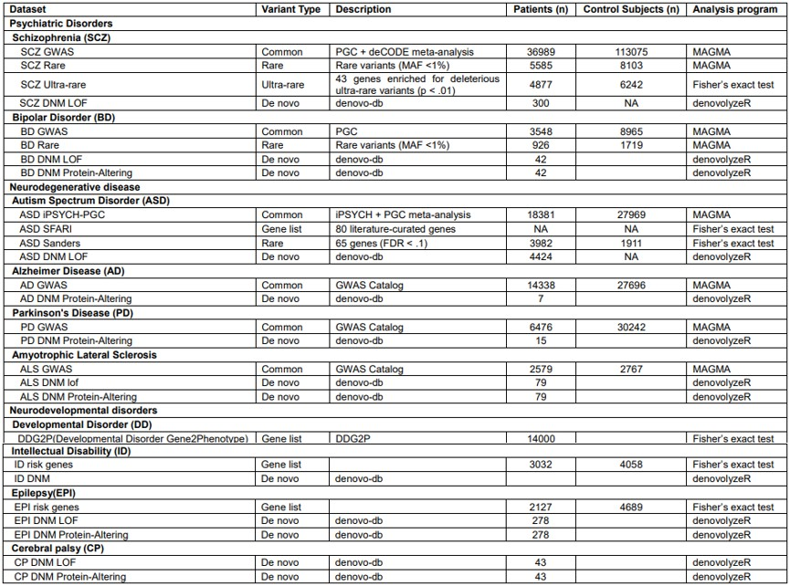
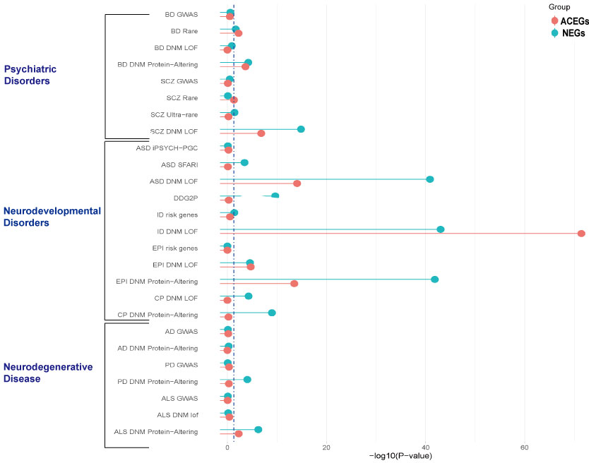
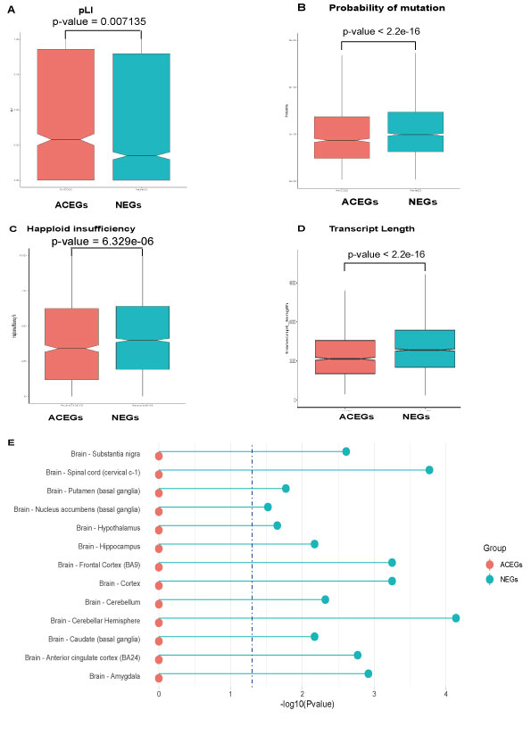

# Essential Genes from Genome-wide Screening as a Resource for Neurological and Mental Disorders Gene Discovery

## Background
This paper has been published in Translational psychiatry.
Essential genes from genome-wide screenings as a resource for neuropsychiatric disorders gene discovery. Wei Zhang, Joao Quevedo, Gabriel R Fries, Translational Psychiatry volume 11, Article number: 317 (2021)

Genome-wide screenings of ‘essential genes’, i.e., genes required for an organism or cell survival, have been traditionally conducted in vitro in cancer cell lines, limiting the translation of results to other tissues and non-cancerous cells. Recently, an in vivo screening was conducted in adult mouse striatum tissue, providing the first genome-wide dataset of essential genes in neuronal cells.

Here, we aim to investigate the role of essential genes in brain development and disease risk with a comprehensive set of bioinformatics tools, including integration with transcriptomic data from developing human brain, publicly-available data from genome-wide association studies, de novo mutation datasets for different neuropsychiatric disorders, and case-control transcriptomic data from postmortem brain tissues.

We will focus on the specific genes from two studies other than the overlapping of the two gene list, we will refer the genes from in vivo CNS screening as NEGs(Neuronal essential genes), the common essential genes from Project Achilles as ACEGs(Achilles Project-specific essential genes)

## NEGs are more likely to exhibit differential expression in brain tissue in neuropsychiatric disorders compared to ACEGs
RNA-seq to detect the differentially expressed genes between patients and controls is a very common approach in biomedical research. We identified 6 datasets in the GEO database with RNA-seq from brain tissue of several case-control studies, including AD, ALS, ASD, HD, PD, and SCZ. We initially downloaded the raw gene expression data and then used the R package DESeq2 to normalize them, or downloaded the DESeq2 normalized data directly, followed by dividing them into up- and down-regulated genes based on the fold change direction. Then, we used Wilcoxon sum rank tests to compare – log10(adj-p-value) calculated by the DESeq2 of the NEGs and ACEGs in the up- and down-regulated gene groups in each dataset. We also calculated the nonparametric Cohen's d to measure the effect size. We found the NEGs were more differentially expressed in the down-regulated genes in AD (Figure 2A, p-value = 8.969e-11, Cohen’ s d = 0.2986), down-regulated genes in ASD (Figure 2B, p-value = 2.239e-07), up-regulated genes in HD (Figure 2C, p-value = 4.772e-9, Cohen’ s d = 0.2670), and up-regulated genes in SCZ (Figure 2F, p-value = 0.001217, Cohen’ s d = 0.2269) than ACEGs (Supplementary Table 8). We also ran a permutation test as negative control, which randomly sampled 3,140 and 1,451 genes (same sizes as the NEGs and ACEGs) from the non-essential gene pool as a control distribution. The permutation was conducted 1,000 times.

a DE p value of Neuronal Essential Genes (NEGs) and Achilles Project-specific essential genes (ACEGs) in GSE95587 (fusiform gyrus tissue sections from Alzheimer’s disease (AD) patients and control). b DE p value of NEGs and ACEGs in GSE64018 (brain cortex from Autism spectrum disorder (ASD) patients and controls). c DE p value of NEGs and ACEGs in GSE64810 (BA9 tissue from Huntington’s Disease (HD) patients and controls). d DE p value of NEGs and ACEGs in GSE122649 (brain cortex from Amyotrophic Lateral Sclerosis (ALS) patients and controls). e DE p value of NEGs and ACEGs in GSE68719 (BA9 tissue from Parkinson’s disease (PD) patients and controls). f DE p value of NEGs and ACEGs in CommondMind Consortium data (brain cortex from schizophrenia (SCZ) patients and controls).

## NEGs and ACEGs are enriched in different co-expression networks and show different temporal expression patterns

We download the Brainspan Developmental Transcriptome data: which covered full period of brain development and all available brain regions (5.7 PCW – 70 years of age; 1,340 samples). We used weighted gene co-expression network analysis (WGCNA) package to construct co-expression modules.

An adjacency matrix was created by computing the correlation between the expression levels of each gene with every other gene using signed biweight correlations; a soft threshold of power of 15 was used to achieve scale free topology.

The adjacency matrix was transformed into a topological overlap matrix (TOM). The network dendrogram (Figure 2S) was generated from the TOM dissimilarity matrix (1-TOM). The ‘Dynamic Hybrid’ method was employed with standard parameters (i.e. pamStage = TRUE, minimum module size = 30, deepSplit = 2, pamRespectsDendro=FALSE), modules with ME correlations >0.9 were. 22 modules were generated.

Next we investigate the enrichment of two gene sets in different modules and the temporal expression pattern.

The above figure shows Neuronal essential genes (NEGs) and Achilles Project-specific essential genes (ACEGs) are enriched in different modules and show different expression patterns. (A) Module enrichment of NEGs and ACEGs. (B) Eigengene expression patterns of modules M12, M20, and M22. (C) Eigengene expression patterns of modules M11, M9, and M19. (D) Eigengene expression patterns of modules M01, M02, and M16.

We collected GWAS data and rare variants data for neuropsychiatric disorders, as well as de novo mutation data from denovo-db23, and then tested the overlap between NEGs and ACEGs among these genetic variants. 
The data is summarized in the following table.

## Association of NEGs and ACEGs with neuropsychiatric genetic risk.

From the above figure, we found that both NEGs and ACEGs significantly overlap with the NDD and psychiatric disorders risk genes41, such as ASD, ID, EPI, CP and SCZ, while only NEGs are enriched in neurodegenerative disorders (PD and ALS) in de novo mutations.

## General gene features of NEGs and ACEGs.

Comparation of other features: probability of a gene being intolerant to LoF (pLI), probability of mutation, gene-level integrated metric of negative selection (GIMS) scores, and haploid insufficiency of Neuronal Essential Genes (NEGs) and Achilles Project-specific essential genes (ACEGs). (A) pLI of NEGs and ACEGs. (B) Probability of mutation of NEGs and ACEGs. (C) Haploid insufficiency rate of NEGs and ACEGs. (D) Transcript Length of NEGs and ACEGs. (E) Tissue expression specificities of NEGs and ACEGs.

## Reference
1. Tsherniak A, Vazquez F, Montgomery PG, et al. Defining a Cancer Dependency Map. (1097-4172 (Electronic)).
2.	Shin JH, Lee Hk Fau - Khang SK, Khang Sk Fau - Kim DW, et al. Neuronal tumors of the central nervous system: radiologic findings and pathologic correlation. (0271-5333 (Print)).
3.	Wertz MH, Mitchem MR, Pineda SS, et al. Genome-wide In Vivo CNS Screening Identifies Genes that Modify CNS Neuronal Survival and mHTT Toxicity. (1097-4199 (Electronic)).
4. Love MI, Huber W, Anders S. Moderated estimation of fold change and dispersion for RNA-seq data with DESeq2. Genome Biology. 2014;15(12):550
5. de Leeuw CA, Mooij JM, Heskes T, Posthuma D. MAGMA: generalized gene-set analysis of GWAS data. (1553-7358 (Electronic)).
6. Langfelder P, Horvath S. WGCNA: an R package for weighted correlation network analysis. (1471-2105 (Electronic)).
